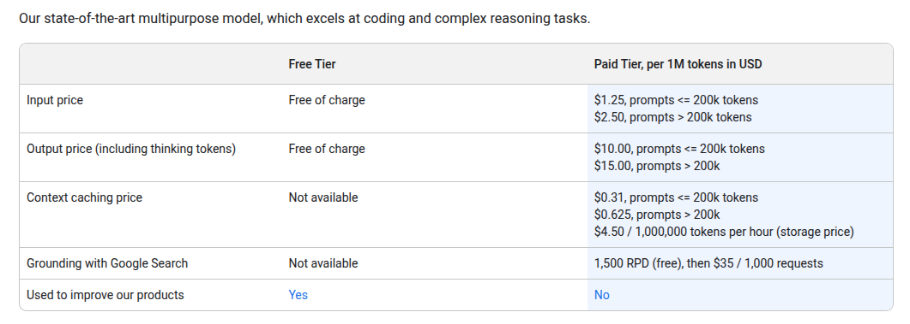

# based on Google's LangExtract example

To use this code:

1. Launch the docker container (`docker compose up`)
2. `docker exec -it ollama ollama pull gemma2:2b`
3. `make all`
4. `make run`

It may be necessary to substitute the container's ID in step 2.

## the code

The code can, with a bit of modification:

1. Fetches a PDF from the FAC (fac.gov)
2. Converts it to text
3. Attempts to extract audit findings

Using a 2B parameter model is a bit thin. Also, the results of this test come from a machine without GPU support (or, the docker stack was not configured to provide GPU support). As a result, it runs slowly.

As structured now, it passes in text that is almost identical to its training data. The results are still poor when it is given clean text that almost perfectly matches the training data.

## results

The file `extraction-gemma2b-flawed.json` shows an example output from this process. It does a poor job (from a rough, one-pass attempt at generating training examples) of extracting the text of audit findings correctly.

It may be that:

1. Prompt tuning
2. Larger models
3. Better training examples

would make a difference. Multiple runs seem to produce different outputs (`001` and `002`), which suggests non-determinism. The second run was better.

## conclusions

Significant testing would be necessary in order to develop an LLM that can reliably extract text from audit reports.

Looking at pricing for Gemini Pro (20250809):



For context, 750 words is approximately 1000 tokens. So, looking at a few audit reports using a command like:

```
python calc_costs.py <url>
```

I get the following word counts and costs:

| report (2023) | words | input cost | 
| -- | -- | -- |
| [Town of Needham, Massachusetts](https://app.fac.gov/dissemination/report/pdf/2023-06-GSAFAC-0000376119) | 30655 | 0.5 |
| [Kentucky State University](https://app.fac.gov/dissemination/report/pdf/2023-06-GSAFAC-0000369519) | 45361 | 0.8 |
| [Commonwealth of Massachusetts](https://app.fac.gov/dissemination/report/pdf/2023-06-GSAFAC-0000027138) | 141334 | 0.24 |

This suggests that 50K audits would cost around $10K (SWAG) to process as  input every year, to say nothing of the computational costs (which are much higher) for the thinking/output. (It is unclear how to estimate those costs at the moment.)

## Model License

Ollama models come with their own licenses. For example:
- Gemma models: [Gemma Terms of Use](https://ai.google.dev/gemma/terms)
- Llama models: [Meta Llama License](https://llama.meta.com/llama-downloads/)

Please review the license for any model you use.
    

